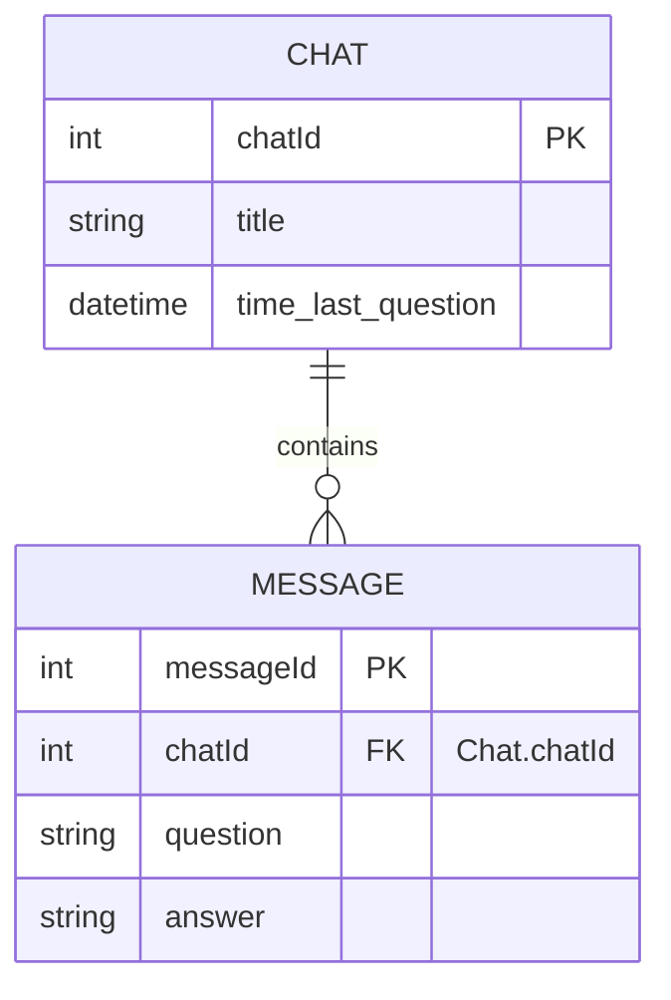

# This is the documentation for the node service.

## Routes

GET / --> serves the index.html file of the web app
GET /health --> returns a 200 status code if the service is up and running

## Database

The databe is a MariaDB database with the following schema:

```sql
-- Table for Chats
CREATE TABLE Chat (
    chatId INT AUTO_INCREMENT PRIMARY KEY,
    title VARCHAR(255) NOT NULL,
    time_last_question DATETIME DEFAULT CURRENT_TIMESTAMP
);

-- Table for Messages linked to a Chat (one-to-many relationship)
CREATE TABLE Message (
    messageId INT AUTO_INCREMENT PRIMARY KEY,
    chatId INT NOT NULL,
    question TEXT,
    answer TEXT,
    reason TEXT,
    FOREIGN KEY (chatId) REFERENCES Chat(chatId)
);
```


